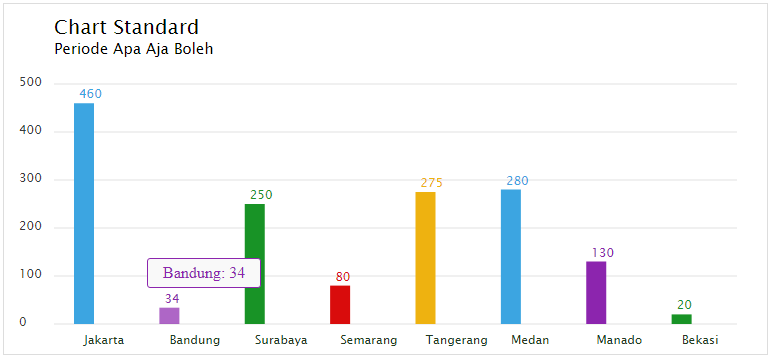

# jc_chart_basic
Simple Chart SVG

# Use
Function and Target ID

    JC_Chart('chart_id_target',
      {
        title		: "Chart Standard", 
        subtitle	: "Periode Apa Aja Boleh"
      },
      {
        "Jakarta"	: 460, 
        "Bandung"	: 34, 
        "Surabaya"	: 250, 
        "Semarang"	: 80, 
        "Tangerang"	: 275, 
        "Medan"		: 280, 
        "Manado"	: 130, 
        "Bekasi"	: 20
      });
      
# Full Example
    <!DOCTYPE html>
    <html>
    <head>
      <title>JC Chart</title>
      
    </head>
    <body>

    

    

    </body>
    </html>
